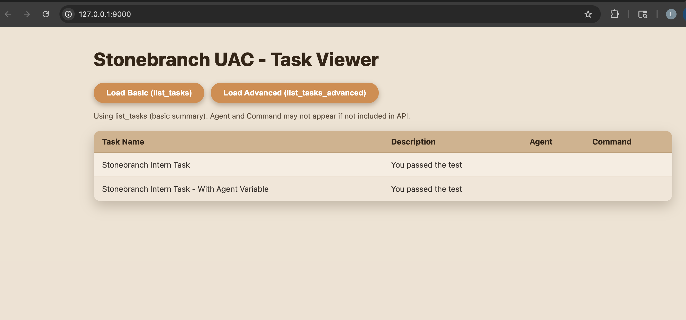

# Stonebranch UAC – Task Viewer (Technical Exercise)

This project is my completed solution for the Stonebranch Solution Engineer Technical Assessment.

The requirement was to connect to the **Stonebranch Universal Automation Center (UAC)**, retrieve tasks using the UAC REST API, extract specific information, and present the output in a simple UI. My implementation follows a clean backend–frontend separation, uses secure practices, and applies object-oriented design principles.

---

# 📌 1. Assessment Requirements

The exercise asked me to:

### ✔ Call the UAC API using Python  
### ✔ Retrieve a list of tasks  
### ✔ Extract **only these four fields**:
- **Task Name**
- **Task Description**
- **Agent Name**
- **Command**

### ✔ Display this data in any UI  
### ✔ Show clean, readable code  
### ✔ Use an object-oriented approach  
### ✔ Include error handling  

---
### API Methods Reviewed (from `uac-api` documentation)
[  
From the `uac-api` package, I reviewed the following available methods:

- `uac.tasks.list_tasks()`
- `uac.tasks.list_tasks_advanced()`
- `uac.tasks.get_task()`
- `uac.tasks.create_task()`
- `uac.tasks.update_task()`
- `uac.tasks.delete_task()`

Other namespaces available:
- `AgentClusters`
- `Triggers`
- `TaskInstances`

For this project, I used only:
- `list_tasks()`
- `list_tasks_advanced()`
]
---


# 📌 2. My Solution Overview (How I Designed It)

I built a **two-layer architecture**:

---

## 🟠 Backend (FastAPI)

The backend:

- Communicates with UAC using the official `uac-api` wrapper  
- Retrieves tasks using:
  - `list_tasks(payload)`  
  - `list_tasks_advanced(query=None)`
- Extracts and normalizes only the required four fields  
- Returns a clean JSON response to the frontend  
- Ask UAC token and exports variable securely
- Provides two endpoints:
  - `/api/tasks/basic`
  - `/api/tasks/advanced`

I used object-oriented design:
- `UacClient` handles connection
- `TaskService` handles business logic
- `TaskInfo` models the simplified output structure

---

## 🟠 Frontend (HTML + JavaScript)

The frontend:

- Fetches data from the FastAPI backend  
- Displays tasks as **cards/boxes** with warm styling  
- Allows switching between Basic and Advanced APIs  
- Has hover animations and clean colors  
- Shows “ ” when a field is missing  

This keeps the UI extremely simple but visually clean and professional.

---

# 📌 3. Field Mapping (Core of the Assignment)

UAC returns many detailed fields, but the requirement was to map only four.

### ✔ My exact mapping:

- name → Task Name
- summary / description → Task Description
- agent → Agent Name
- command → Command


### ✔ If a field is missing in UAC:
- Backend returns `null`
- Frontend displays `""`

This ensures stable behavior regardless of differences between UAC environments.

---

# 📌 4. UAC API Functions Used

From `uac-api`, I used:

### 1. `uac.tasks.list_tasks(payload)`
- Summary task information  
- Used for **Basic view**

### 2. `uac.tasks.list_tasks_advanced(query=None)`
- Complete task definition  
- Used for **Advanced view**

These two calls satisfy the exact requirement to retrieve tasks and show mapped fields.

---

# 📌 5. Backend File Breakdown

### `main.py`
- FastAPI application  
- Registers:
  - `/api/tasks/basic`
  - `/api/tasks/advanced`  
- Adds CORS so frontend can call backend  
- Injects TaskService  

### `uac_client.py`
- Reads `UAC_URL`  from environment  and `UAC_TOKEN` from terminal
- Creates UniversalController client  
- Ensures token is **not exposed** and authentication is validated  

### `task_service.py`
- Object-oriented business logic  
- Calls UAC APIs  
- Applies mapping rules  
- Handles missing fields  
- Returns list of `TaskInfo` objects  

### `models.py`
- `TaskInfo` dataclass → internal data structure  
- `TaskInfoSchema` → API response model  

### `requirements.txt`
Backend dependencies.

---

# 📌 6. Frontend File Breakdown

### `index.html`
- Buttons for Basic / Advanced  
- Container for task cards  
- Loads `app.js` and `styles.css`  

### `styles.css`
- Warm beige theme  
- Card-based layout  
- Button animations and shadows  
- Clean typography  

### `app.js`
- Calls backend endpoints  
- Converts responses into cards  
- Handles loading and error states  
- Renders consistent UI  

---

## 📍 7. Running the Project

### ▶️ Start Backend
```bash
cd backend
chmod +x run_backend.sh
./run_backend.sh
```

- Loads `UAC_URL` from environment  
- securely prompts for `UAC_TOKEN`  
- Starts FastAPI on **http://127.0.0.1:8000**

**Backend URLs**
- http://127.0.0.1:8000/docs  
- http://127.0.0.1:8000/api/tasks/basic  
- http://127.0.0.1:8000/api/tasks/advanced  

---

### ▶️ Start Frontend
```bash
cd frontend
chmod +x run_frontend.sh
./run_frontend.sh
```

**Frontend URL**
- http://127.0.0.1:9000  

---

## 📍 8. UI Output (What You See)

### Buttons
- **Load Basic (list_tasks)**  
- **Load Advanced (list_tasks_advanced)**  

### Task Card Fields
- **Task Name**  
- **Description**  
- **Agent**  
- **Command**  

### UI Style
- Card layout  
- Warm beige palette  
- Soft shadows  
- Hover animations  
- Clean spacing  

### Missing Fields
- Displayed as `" "`  

---

## 📍 9. Security: UAC Token Handling

### Token Protection
- **Never hardcoded**  
- **Never stored** in frontend  
- **Never logged**  
- **Not included** in repository  

### Token Source
- `UAC_TOKEN` read securely via hidden prompt in `run_backend.sh`  

### Backend-Only Access
- Token used **only server-side**  
- Frontend receives **sanitized output only**  
- No credential exposure to browser or logs  

---

## 📍 UI Preview

Below are example screenshots of the UI:

### Task Cards View


